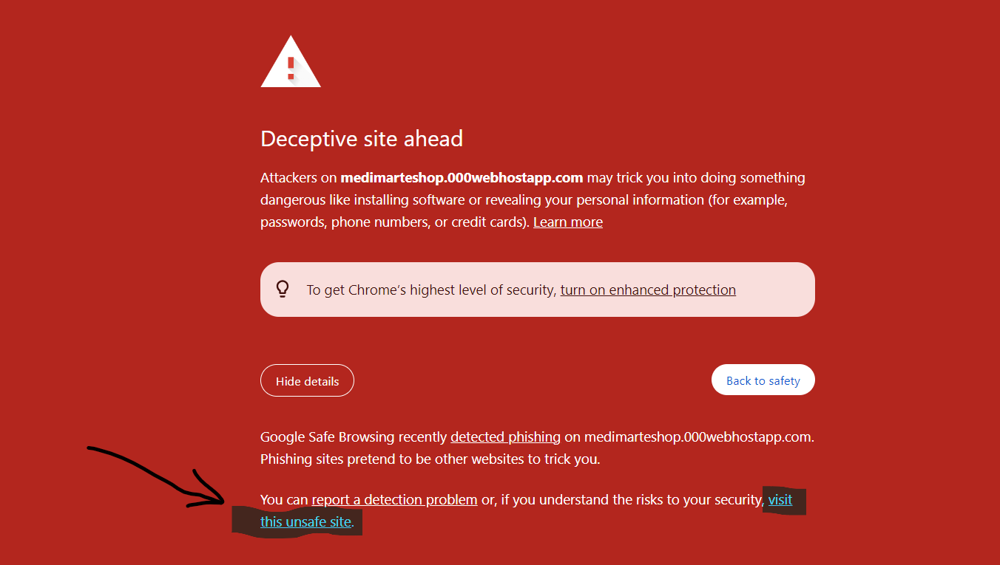

# Medimart-E-Shop

Medimart E Shop is an e-commerce platform designed specifically for MBBS students to simplify the process of purchasing medical books, both new and used, as well as other related products.

### Technologies Used

- PHP
- MySQL
- JavaScript
- jQuery
- HTML
- CSS
- Ajax
- Animation on Scroll-AOS 

## How To Run This Project On Your Local Machine ? 

### Getting Started :: Step By Step

To get started with the project, follow these steps:

1. **Clone the Repository**
   - clone the repository and put it inside htdocs folder of xampp
   ```bash
   git clone https://github.com/irfanhsajid/CSE327-Group1-Project.git
2. **Database Setup**

   - Create a database medimart_db
   - inside the database import medimart_db.sql from the **db** folder (inside repository)
   - configure the database c

3. **Database Configuration**

   - inside connect.php, replace your own db name. If it's 'medimart_db' (as if I mentioned earlier) then you don't need to change anything. 

4. **Run The Application**
   - Start your local server (XAMPP)
   - Open the browser and go to http://localhost/your-folder-name/index.php

4. **Usage Application**
   - Create an account or log in if you already have one.
   - Browse through the available categories and products.
   - Add desired items to the cart and proceed to checkout.
   - for order placing you must update your address and select a payment method 
   - If its online payment then you need to give your email, full name, card information (you can use this card information **4242 4242 4242 4242** and CVC = any 3 digit ) 
    - or you can choose cash App Pay 

  
  

5. **Features**

   - Browse and search for medical books by category or title or price.
   - View detailed information about each product by clicking quick view button (Icon)
   - Add items to the shopping cart and complete the purchase.
   - View order history and track the status of current orders.
   - User can directly send feedback from contact page. 


### **Admin Panel Management**
   - Admin can register a new admin,
   - manage all products (CRUD) ,
   - manage all orders (CRUD), 
   - view all users feedbacks,
   - view and manage all the registered users and admins. 

admin url: http://localhost/your-folder-name/admin/admin_login.php

default username : admin

& password : 111

### Hosting Info: 

#### Live url : http://medimarteshop.000webhostapp.com 

##### Security Error: 
Since the website is hosted for free, it doesn't have an SSL certificate. As a result, it may display a warning indicating that the site is not secure or potentially dangerous. To proceed, you'll need to **click the details button** and choose to **visit the unsafe site** despite the warning. Then it will work file. 



If Its Working fine then you will see this page : 


#### Admin url : http://medimarteshop.000webhostapp.com/admin/admin_login.php
username : IrfanSajid

& password : 123456

after successfuly logged in , you will see this dashboard : 


That't it ! Explore all the features and feel free to notify me if you face any issues while running this project. 

***

#### Author: [Irfanul Haque Sajid](https://irfanhsajid.netlify.app) 